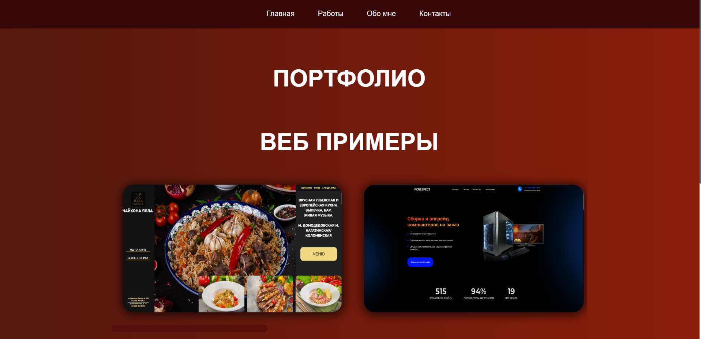
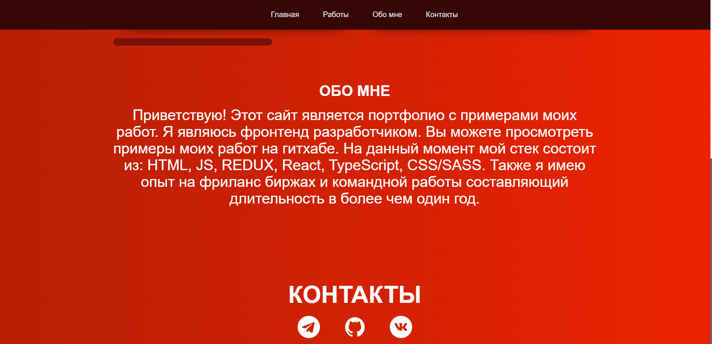

# 🧑‍💻Портфолио на React ⚡

Cовременный и минималистичный сайт-портфолио, разработанный с нуля на **React**.  
Здесь собрана информация обо мне, моих навыках, проектах и способах связи. Упор на стиль, адаптивность и ясную навигацию 🧩🎯


---

## 🌐 Демо

🔗 Демонстрация: (https://infinityhybridport.netlify.app/)

---

##🖼️ Скриншоты

\


## ✨ Особенности

- 👨‍💼 **Обо мне** — кратко и по делу: кто я, чем занимаюсь, какие технологии использую
- 🧠 **Навыки** — красиво оформленный стек технологий
- 🚀 **Проекты** — с ссылками на GitHub и описаниями
- 📱 **Адаптивность** — отлично выглядит на всех устройствах
- 📩 **Контакты** — быстрая связь через Telegram, GitHub, email и другие соцсети

---

## 🚀 Запуск проекта

```bash
# 1. Клонируй репозиторий
git clone https://github.com/Badadsher/mainresumWeb.git

# 2. Перейди в директорию
cd mainresumWeb

# 3. Установи зависимости
npm install

# 4. Запусти dev-сервер
npm run dev
